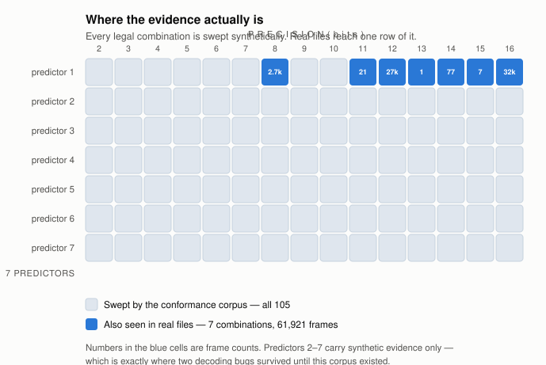

# Three decoders, one misreading

### What conformance testing catches that agreement between implementations cannot

**Rungroj T.** · 2026 · [github.com/yahkuza99/plumbline](https://github.com/yahkuza99/plumbline)

---

## Abstract

Lossless JPEG (ITU-T T.81 Annex H) carries most of the pixel data on medical
imaging discs, and a decoder for it can fail in a way nothing downstream can
detect: it returns an array of the right shape and dtype, containing the wrong
numbers. We report two results from building a decoder for this format.

First, *our own* three independent implementations
shared two misreadings of Annex H and agreed with each other perfectly while
doing so. Because the conformance corpus was generated by an encoder written
from the same misreading, a round trip through our own code confirmed the
error rather than exposing it. Both were caught only by comparison against an
implementation sharing no code with ours.

Second, we show that the legal parameter space of this format is small enough
to enumerate rather than sample — 105 combinations of precision and predictor,
swept exhaustively — and that doing so is what surfaced the two bugs above. A
corpus of 61,921 real frames from 105 scanner builds did not, because
every one of them used a single predictor.

We release the decoder under Apache-2.0 and the conformance corpus alongside
it, so that any decoder for this format can be checked against a fixed,
citable reference rather than against another decoder's opinion.

---

## 1. The failure mode

A decoder that crashes is a decoder that has told you something. The dangerous
case is the one that returns an image.

In medical imaging the consumer of a decoded frame is usually a human looking
at a picture, and there is no checksum between the two. A decoder that
mis-tracks the entropy stream produces *structured* error — the prediction
carries forward, so the corruption follows the image's own geometry. It looks
like noise, or like an artefact of the modality. It does not look like a bug.

This shapes every design decision below into one rule:

> **Decode correctly, or raise. Never return plausible wrong pixels.**

The rule is not a slogan. It is a decision procedure: whenever the standard
does not define an answer, the implementation must refuse rather than pick the
most reasonable-looking interpretation. §3.3 gives a case where following it
cost measurable throughput, and §4 gives one where violating it would have been
invisible for years.

---

## 2. Method

### 2.1 Three implementations, one contract

The project ships a compiled C core, a numba fallback, and a pure-Python
reference. All must produce identical bits or refuse. The reference is written
to be read against the standard clause by clause, with clause numbers in the
comments, and is the oracle the other two are tested against.

This is a good architecture for catching *implementation* error and — as §5
shows — completely blind to *interpretation* error.

### 2.2 Enumerating the legal space

The parameter space of Annex H is bounded: precision 2–16, predictors 1–7, one
to four components, point transform below precision, and restart intervals
constrained to whole MCU rows. The product of the first two is 105
combinations, which is small enough to enumerate.

That matters more than it first appears. A test suite covers what its author
imagined; enumeration covers what the standard permits. Precisions of 11, 13
and 15 bits appear in real files and were absent from our hand-written tests,
not by oversight but because nobody thinks to write down 13.



### 2.3 Round trip, and why it is not enough

Each valid case is produced by encoding a chosen image, so the expected pixels
are the input rather than any decoder's output. This removes the obvious
circularity of asserting that a decoder agrees with itself.

It does not remove the real one. §4.

### 2.4 Cases with no right answer

A second group of frames is malformed in ways the standard does not define: a
truncated scan, a Huffman table the scan names but nobody declares, a restart
interval announced and never emitted, restart markers out of sequence,
subsampling, precision zero.

For these the corpus asserts only that a decoder must **not** return an image.
They have no correct output, so any output is incorrect. Of the 16, the number
each deployed decoder returns pixels for:

| decoder | returns an image | refuses |
|---|---:|---:|
| implementation A | 11 | 5 |
| implementation B | 8 | 8 |
| implementation C | 6 | 10 |
| implementation D | 6 | 10 |
| plumbline | **0** | **16** |

Refusing malformed input is a policy choice rather than a correctness
property, and reasonable implementations differ. It is reported because a
decoder's behaviour on input it cannot read is exactly what a caller handling
files of unknown origin needs to know, and it is not documented anywhere else.

Implementations are unnamed here because the point is the spread, not a
verdict on any of them: on input the standard does not define, four
independent decoders disagree about what to do, and none of them documents
its choice. A caller reading files of unknown origin has no way to know which
behaviour they are relying on.

### 2.5 Real files

61,921 lossless-JPEG frames — 26.1 billion pixels, 105 distinct
(manufacturer, model, modality) builds from 27 manufacturers — were decoded to detect refusals, crashes and hangs.
Comparing every frame against the pure-Python reference is impractical at
~0.15 Mpx/s, so one frame from each distinct parameter combination was
re-decoded and compared bit for bit.

---

## 3. Results

### 3.1 Coverage

| | |
|---|---|
| Conformance corpus | 1,707 cases — 1,691 must decode, 16 must be refused |
| Legal (precision × predictor) space | 105 of 105 |
| Real frames | 61,921 · 0 refused · 0 crashed |
| Covering sample vs the reference | 185 exact, 0 differing |

### 3.2 Cross-implementation agreement

Before and after the corrections of §4. **These are two different corpora**,
not one corpus scored twice: the earlier one held 1,706 cases and swept
restart intervals of 1, 3 and 40 pixels — values §4 establishes are not legal
— and the current one holds 1,707 and sweeps whole rows.

| decoder | before, on the old corpus | after, on the current one |
|---|---:|---:|
| independent implementation A | 234 / 1,706 | **1,690** / 1,707 |
| independent implementation B (libjpeg-turbo) | — | **1,701** / 1,707 |

Reproduce the "before" column with:

```sh
git archive f77606d^ conformance | tar -x -C /tmp/old
python /tmp/old/conformance/run.py       # every decoder installed
```

The 17 cases A still disagrees on are 11 where it does not apply the point
transform and 6 malformed frames it accepts. B disagrees on 6, all malformed
frames it accepts — **it matches on every one of the 1,691 conforming cases,
including the point transform.** Both are ordinary differences between
implementations, and neither is offered here as a defect report.

**plumbline scores 1,707 of 1,707, and that number is not evidence.**
`conformance/generate.py` writes a case to the corpus only after the reference
implementation has decoded it to the expected image, or refused it where a
refusal is required. A case this decoder fails therefore cannot enter the
corpus, and the score is a property of how the corpus is built rather than a
measurement of the decoder. (In the current build nothing was withheld: 15
precisions × 7 predictors × 4 component counts × 4 restart values ÷ 4
patterns + 11 point-transform cases = 1,691, which is the whole set.) The
scores that carry information are the ones from decoders we did not write.

The 17 residual disagreements are that implementation's own gaps: 11 frames
where it does not apply the point transform and returns saturated values, and
6 malformed frames it accepts.

**This is the paper's central measurement.** It was fixed as the success
criterion *before* the change was written, precisely so that the change could
fail it: a correction to our reading of the standard had to make an unrelated
implementation agree with us more often. Nothing produced by our own test
suite could have demonstrated that, as §3.2's last paragraph and §4 both show.

### 3.3 The price of refusing

Validating the entropy-coded segment before decoding it — checking marker
sequence, byte stuffing, and restart-marker count — costs about **9%** of
throughput (135.5 → 123.9 Mpx/s median). The validation walks the scan a
second time to find `0xFF` bytes that the C destuffing pass already visits and
could report for free.

That figure was obtained by disabling `reference.check_scan` by hand and
re-running the benchmark, which is not something the repository can do on its
own: **there is no flag for it, so the measurement is not reproducible from a
clean checkout.** It is reported with that caveat rather than dropped, because
the cost is real and someone will otherwise remove the check without knowing
what it was bought with. A source comment elsewhere puts the figure at 6%; the
two were measured on different frames and neither run was kept.

The duplicated pass was kept. Writing that logic twice in two languages is how
two copies begin to disagree, which is the failure this project exists to
prevent. It is recorded here because a 9% cost paid for a property nobody can
see is exactly the kind of decision that gets quietly reversed later.

---

## 4. The result we did not expect

### 4.1 Two shared misreadings

§H.1.2.1 contains two rules where a careless reading finds one:

> "The one-dimensional horizontal predictor (prediction sample Ra) is used for
> **the first line of samples** at the start of the scan **and at the beginning
> of each restart interval**. […] **At the beginning of** the first line and at
> the beginning of each restart interval **the prediction value of 2^(P−1) is
> used**."

The default value applies to the first *sample*; predictor Ra applies to the
first *line*. We implemented the first and missed the second.

Separately, the same clause specifies that differences are computed **modulo
2^16**. Our documentation stated modulo 2^P, and the conformance encoder was
written from our documentation.

### 4.2 Why nothing caught them

Each mechanism failed for a different reason, and the pattern is the point:

| mechanism | why it passed |
|---|---|
| three implementations agreeing | all three were written from the same reading of the standard |
| round trip through the corpus | the encoder shared the misreading with the decoders |
| 61,921 real frames | every one used predictor 1, where the first bug does not manifest |
| the modulo error specifically | under modulo 2^P the SSSS = 16 case cannot arise, so the code path that would have exposed it was unreachable |

The last row deserves emphasis. **The two errors concealed each other.** The
wrong modulus removed the only input that would have revealed the wrong
predictor rule.

### 4.3 What did catch them

Comparison against an implementation that shares no code, no author, and no
reading of the standard with ours. Under the corrected rules its agreement with
the corpus went from 234 to 1,690 of 1,707 cases.

The general form is uncomfortable and worth stating plainly:

> **Agreement between implementations measures shared assumptions, not
> correctness. Implementations that share a misreading agree perfectly and are
> wrong together.**

A project that verifies itself only against itself — however many independent
implementations it has, however rigorous the round trip — is measuring its own
consistency. That is worth having. It is not evidence of correctness, and the
better it looks the more convincing the mistake it can conceal.

---

## 5. Limitations

**Every predictor in all 61,921 real frames was 1.** Predictors 2–7 carry
synthetic evidence only. This is the sharpest limitation here, and it is
exactly where both bugs lived.

**The vendor distribution is uneven.** Siemens, GE and Philips CT and MR
dominate. Konica Minolta and Shimadzu do not appear at all. Eight frames of
public research data under CC BY were added to widen coverage — contributing
PET, a modality otherwise absent — but they are predictor 1 as well.

**Restart intervals in real data were uniform.** Every frame that restarts at
all restarts once per row. Intervals that are legal but unusual are covered
synthetically and not otherwise.

**"No known silent failures on the corpus we have"** is much weaker than
"correct". It is also the strongest claim anyone can honestly make about a
decoder, and any project claiming more should be read carefully.

**Reproducibility — what can and cannot be re-run from a clean checkout.**

| claim | reproducible from the repository |
|---|---|
| §2 in full — the 840/840 split, the control, the absence of warnings | **yes** · `conformance/run.py` over committed frames |
| §2.4 malformed-frame table | **yes** · same |
| §3.2 before / after | **yes** · with the `git archive` command given there |
| §3.1 conformance counts | **yes** · `conformance/generate.py`, `run.py` |
| the eight public sample frames | **yes** · committed under CC BY |
| §2.5 and §3.1 real-file figures — 61,921 frames, 26.1 billion pixels, 105 configurations, 185 exact | **no.** The files cannot be redistributed, and the script that produced these numbers is not in the repository. They rest on our word |
| §3.3, the 9% | **no.** Measured by editing the source; no flag exists |

An earlier draft of this paper claimed that every number came from three named
scripts. That was not true, and it was caught in review rather than by us.
Publishing a reproducibility claim that does not survive being checked is
worse than publishing none, because it invites the reader to distrust the
parts that would have held.

---

## 6. Practical consequences

**For anyone decoding lossless JPEG.** If you call a decoder directly rather
than through a format-detecting entry point, check it against a corpus with
restart markers. This is not a hypothetical class of file — it is most files
from several manufacturers.

**For anyone testing a decoder.** Enumerate the legal space if it is small
enough to enumerate; this one is. Then validate against an implementation you
did not write. Round trips through your own encoder prove the two halves agree
with each other, which is a weaker statement than it appears.

**For anyone building a corpus.** State what is *not* in it. Ours would look
authoritative at 61,921 frames while containing exactly one predictor. The
count invites a conclusion the composition does not support.

---

## 7. Availability

Decoder and corpus: [github.com/yahkuza99/plumbline](https://github.com/yahkuza99/plumbline),
Apache-2.0, no copyleft dependencies.

The conformance corpus is intended to be used against decoders other than
this one. If it declares a decoder wrong, the disagreement is a fact about two
artefacts and the corpus is not privileged: every case cites the clause it
tests, so the argument can be had with the standard rather than with us.

Contradicting evidence is more useful to this project than agreement, and a
frame we decode incorrectly is the most valuable thing anyone can send.

---

## Notes

Where results from other implementations appear, they are measurements taken
to check this one, not assessments of those projects. They are unnamed for
that reason: a number produced to validate our own decoder is not a fair
basis on which to characterise someone else's.

No patient data was published, redistributed, or included in the repository.
The conformance corpus is synthetic. The eight committed sample frames are
public research data under CC BY, attributed in `NOTICE`.
